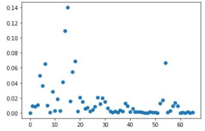
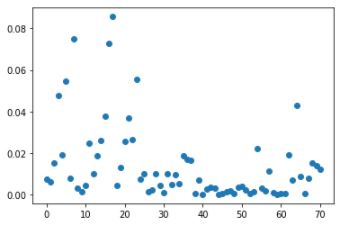
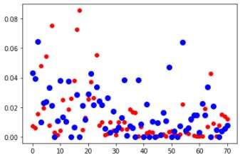
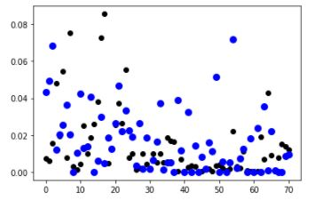

# <p align=center>`Tesla Sales Prediction`</p>

`Motivation`: Given records of Tesla car sales from Quarters 1-2 in California for 2019, make predictions as to which car configurations will be sold more than others in Quarters 3 and 4, to ensure enough inventory to meet demands. 

`Data Description`: The dataset contains vehicle sales records from quarters 1-4 in California for 2019. The model type, engine variant, sales category, MSRP, dealer state, and date of sale are featured in each transaction record. 


`Modules`
```python
import os 
import tensorflow as tf
from tensorboard.plugins import projector 
import numpy as np 
import pandas as pd
import matplotlib.pyplot as plt
```

`Tasks`: 
* Find numbers of unique car combinations sold for training and test data sets. The car's `'main_type'`, `'engine'`, `'sales_version'`, and `'MSRP'` values are all known before the time of the sale and do not, by themselves, offer anything which can be predicted. However, each row represents the sale of a single car. By defining a unique car type by its combination of `'main_type'`, `'engine'`, and `'sales_version'` values, the number of rows displaying that combination corresponds to the number of times during that half of the year that that distinct type of car was sold in California. Therefore, we can make training and test datasets where each row now corresponds to a unique car type, and the target value is how many times that car type was sold in California during a given half of the year.

```python
def get_features_and_targets(df):
    # Create the local data DataFrame as a copy of the input df DataFrame, minus the 'MSRP' column
    data = df.drop(columns=['MSRP'])
    # Use the value_counts() method for DataFrames to store the targets as a NumPy array of the 
    # normalized sales counts associated with each unique combination of 'main_type', 'engine', 
    # and 'sales_version' values in the data DataFrame
    Y = np.array(data.value_counts(sort=False, normalize=True))[:, np.newaxis] 
    # Get a list of the column names of the data DataFrame
    subset_names = data.columns.values.tolist()
    # Use the drop_duplicates() method on the df DataFrame to store the features data as a NumPy array where
    # each row corresponds to a unique combination of 'main_type', 'engine', and 'sales_version' values
    X = np.array(df.drop_duplicates(subset=subset_names))
    # Scale and shift the 'MSRP' column so its values fall in the range [0,1]
    X[:,-1] = ( X[:,-1] - min(X[:,-1]) ) / np.ptp(X[:,-1])
    # Return features and targets
    return X, Y
```

* Using probability equations, determine how many car models were sold in both halves of 2019, how many were discontinued by the second half of the year, and how many were launched in the second half of the year. 

```python
models_q12_or_q34 = len(data_Y)
models_q12 = len(train_Y)
models_q34 = len(test_Y)
models_q14 = models_q12 + models_q34 - models_q12_or_q34
discontinued = models_q12 - models_q14
launched = models_q34 - models_q14
print(f"{models_q14} models were sold throughout 2019")
print(f"{discontinued} models were discontinued by the second half of 2019")
print(f"{launched} models were launched in the second half of 2019")
```

* Visualize the training and test targets

<p align=center>Training Targets</p>
<p align=center></img></p>

<p align=center>Testing Targets</p>
<p align=center></img></p>

* Apply stochastic gradient descent using base model
```python
# learned parameters theta and hyperparameters
s_theta = np.zeros((train_X.shape[1]+1, 1))
s_learning_rate = 0.001
s_max_iteration = 1000

# hypothesis function
def h (theta, X) :
    tempX = np.ones((X.shape[0], X.shape[1] + 1))
    tempX[:,1:] = X
    return np.matmul(tempX, theta)
    
# loss Function
def loss (theta, X, Y) :
    return np.average(np.square(Y - h(theta, X))) / 2

# gradient of hypothesis function
def gradient (theta, X, Y) :
    # Create a temporary X array with an added 0th bias column
    tempX = np.ones((X.shape[0], X.shape[1] + 1))
    tempX[:,1:] = X
    # Compute the gradient according to the instructions above
    d_theta = - np.dot(tempX.T, Y - h(theta, X)) / X.shape[0]
    return d_theta

# gradient descent
def stochastic_gradient_descent (theta, X, Y, learning_rate, max_iteration, gap) :
    # Initialize the cost as an array of zeros, one for each iteration through the dataset
    cost = np.zeros(max_iteration)
    # Loop over the dataset
    for i in range(max_iteration):
        # Loop over each row in the dataset
        for j in range(X.shape[0]):
            # Compute the gradient from the current row in X and the associated Y value
            # Make sure that both X and Y are represented as 2D row vectors
            d_theta = gradient (theta, X[np.newaxis, j, :], Y[np.newaxis, j, :])
            # Update theta
            theta = theta - learning_rate * d_theta
        # Update the cost array for the current iteration
        cost[i] = loss(theta, X, Y)
        if i % gap == 0 :
            print ('iteration : ', i, ' loss : ', loss(theta, X, Y)) 
    return theta, cost    
    
s_theta, s_cost = stochastic_gradient_descent(s_theta, train_X, train_Y, s_learning_rate, s_max_iteration, 100)    
```

* Visualize the predicted (base model) and actual test labels 
<p align=center></img></p>

* Generate predictions using regularized normal equations
Since the dataset is wider than it is tall, a regularized normal equations might perform better in generating label predictions.
```python
# set parameters
lamb = 0.05
m = train_X.shape[0]
I = np.identity(train_X.shape[1])

# compute regularized weights
W2 = np.linalg.pinv(train_X.T.dot(train_X) + lamb*m*I).dot(train_X.T.dot(train_Y))

# make predictions
PN2 = test_X.dot(W2)

# set negative predictions to 0 
PN2[np.where(PN2<0)] = 0
```

* Visualize the predicted labels from regularized normal equations and actual test labels 
<p align=center></img></p>

* Implement non-linear regression models (GLM, DT) and visualize predicted and actual labels
```python
# GLM 
import statsmodels.api as sm
# Instantiate the GLM
glm_gamma = sm.GLM(train_Y, train_X, family=sm.families.Gaussian())
# Train the GLM
glm_results = glm_gamma.fit()
print(glm_results.summary())

# Random Forest Regression
from sklearn.ensemble import RandomForestRegressor
# Instantiate the random forest regression model
regr = RandomForestRegressor()
# Train the model
regr.fit(train_X, train_Y)
# Generate predictions from the test data
pred_rf = regr.predict(test_X)
```
* Populate a table with the results of the experiments above and determine which model perfomed best. 
```python
## Results
---------------------------------------------------------------------------
Method                                          |  RMSE             | R2               |
-------------------------------------------------------------------------------------
1. Stochastic Gradient Descent | 0.000518924229453394 | 0.6939013195958598
2. Normal Equations | 0.0005596570062877884  | 0.8479142625775213
3. Regularized Normal Equations | 0.0004604483532264239 | 0.4015654423847725
4. GLM | 0.0005596570062877873 | 0.847914262577519
5. Decision Trees | 0.000641660130480879 | 0.8815598998343828 |
```


